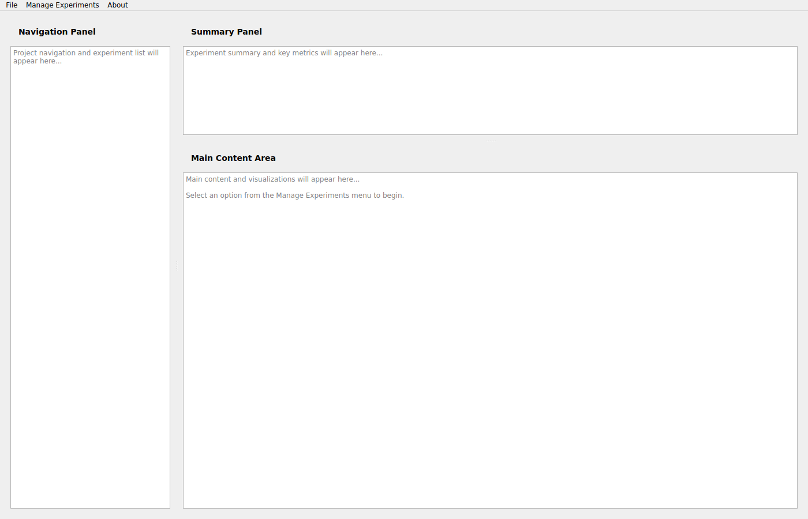

# MLR Working Party

Machine Learning Research Working Party - A comprehensive toolkit for managing experiments and analyzing insurance claims data.

## New: PyQt6 GUI Application

A fully-featured graphical user interface has been added to streamline experiment management and data analysis.

### Quick Start

1. **Install Dependencies:**
   ```bash
   pip install -r requirements.txt
   ```

2. **Run the GUI:**
   ```bash
   python3 run_gui.py
   ```
   
   Or directly:
   ```bash
   cd 02_code
   python3 mlr_gui_app.py
   ```

3. **Load Sample Data:**
   - Generate sample data: `python3 02_code/generate_sample_data.py`
   - Or use your own CSV file

### GUI Features

#### Main Interface
- **3-Pane Layout**: Navigation (left), Summary (top), Content (center)
- **Menu Bar**: File, Manage Experiments, About
- **Responsive Design**: Adjustable pane sizes

#### Analyze Data Insights (Fully Implemented)
Access via: **Manage Experiments → Analyze Data Insights**

1. **Data Preview Tile**
   - Visual feature distributions
   - Histograms and bar charts
   - Summary statistics
   - Adjustable sample size

2. **Features Tile**
   - Comprehensive feature table
   - Missing value analysis
   - Statistical measures
   - Interactive detail view

3. **Feature Lists Tile**
   - Create custom feature lists
   - Manage existing lists
   - Retrain models with selected features
   - Multi-select interface

4. **Data Insights Tile**
   - Correlation matrix heatmaps
   - Feature associations
   - Pairwise correlations
   - Dependency detection

### Screenshots


*Main application window with 3-pane layout*


*Data preview with visual feature representations*


*Feature correlation analysis*

For more screenshots, see the [screenshots](screenshots/) directory.

## Project Structure

```
MLR_working_party/
├── 01_data/                     # Data files
│   └── sample_data.csv          # Generated sample dataset
├── 02_code/                     # Source code
│   ├── mlr_gui_app.py          # Main GUI application
│   ├── analyze_data_insights.py # Data insights module
│   ├── generate_sample_data.py  # Sample data generator
│   ├── README_GUI.md           # Detailed GUI documentation
│   ├── SMD/                    # Sequential Model Development
│   │   ├── GRU_framework_NJC.py
│   │   └── utils/              # Utility modules
│   └── test_gui_simple.py      # GUI tests
├── screenshots/                 # Application screenshots
├── requirements.txt            # Python dependencies
└── run_gui.py                 # GUI launcher script
```

## Existing Code

The repository includes sophisticated neural network implementations:

### GRU Framework
- Recurrent neural network for claims prediction
- TensorBoard integration
- SHAP explanations
- Configurable architecture

### Utilities
- `config.py`: Centralized configuration management
- `data_engineering.py`: Data preprocessing pipelines
- `neural_networks.py`: Custom network architectures
- `shap.py`: Model interpretability tools

## Documentation

- **GUI Documentation**: [02_code/README_GUI.md](02_code/README_GUI.md)
- **Code Structure**: See individual module docstrings
- **Configuration**: See `02_code/SMD/utils/config.py`

## Requirements

### Python Packages
```
PyQt6>=6.5.0
pandas>=2.0.0
numpy>=1.24.0
matplotlib>=3.7.0
seaborn>=0.12.0
scipy>=1.10.0
```

### System Dependencies (Linux)
```bash
sudo apt-get install -y xvfb libegl1 libxkbcommon-x11-0 libxcb-cursor0
```

## Testing

### GUI Tests
```bash
cd 02_code
xvfb-run -a python3 test_gui_simple.py
```

### Unit Tests
```bash
cd 02_code/SMD
python3 test_refactored_code.py
```

## Usage Examples

### Using the GUI
1. Launch the application: `python3 run_gui.py`
2. Go to **Manage Experiments → Analyze Data Insights**
3. Click **Browse** to select a CSV file
4. Click **Load Dataset**
5. Explore the four analysis tabs

### Using Existing Code
```python
from SMD.utils.config import get_default_config
from SMD.utils.data_engineering import load_and_process_data

# Load configuration
config = get_default_config()

# Process data
data = load_and_process_data(config)
```

## Contributing

This is a research project for the MLR Working Party. For contributions:
1. Follow the existing code structure
2. Add tests for new features
3. Update documentation
4. Take screenshots for GUI changes

## Future Enhancements

The GUI framework is extensible. Planned features include:
- Experiment Setup interface
- Blueprint Repository management
- Model Leaderboard visualization
- Experiment Insights dashboard
- Model comparison tools
- Interactive blueprint editing

## License

MLR Working Party Research Project

## Contact

For questions or support, please contact the MLR Working Party team.
