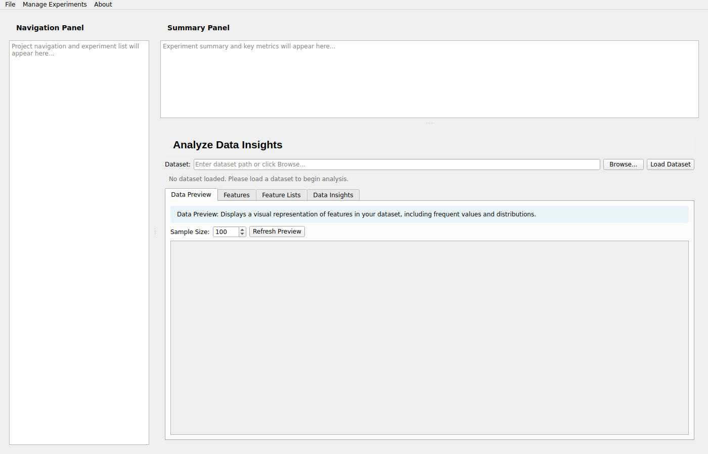
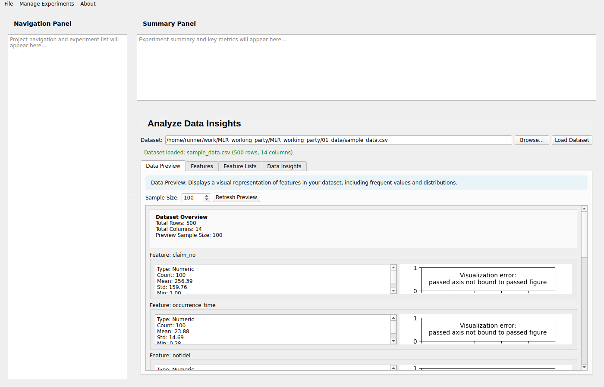
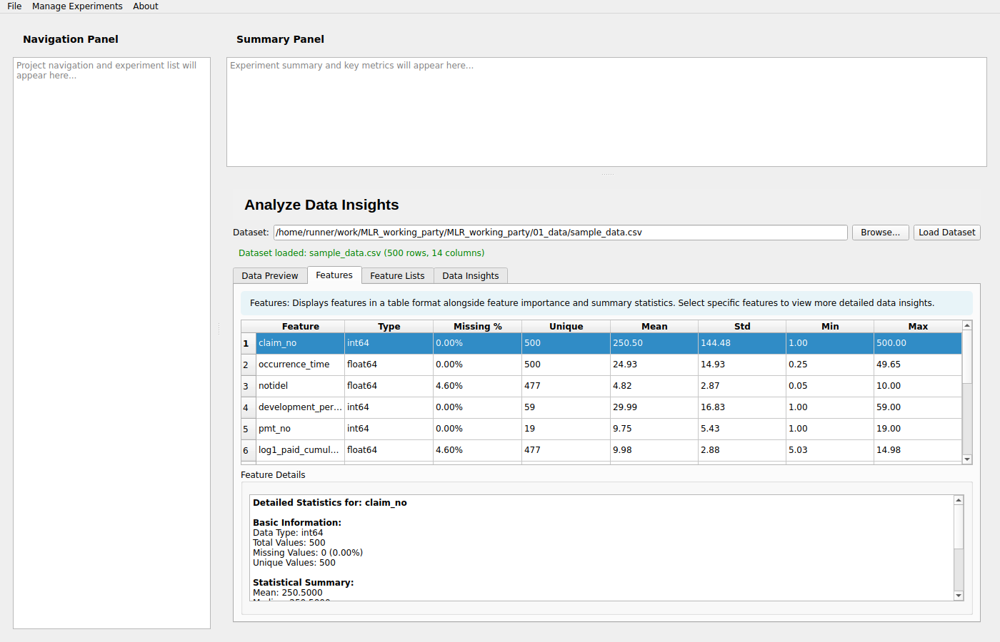
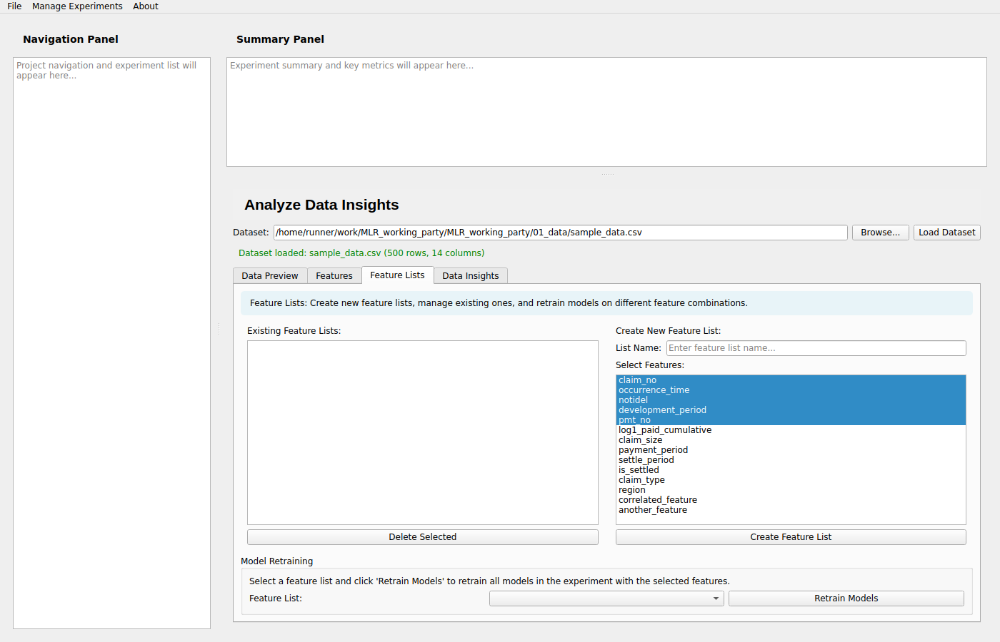
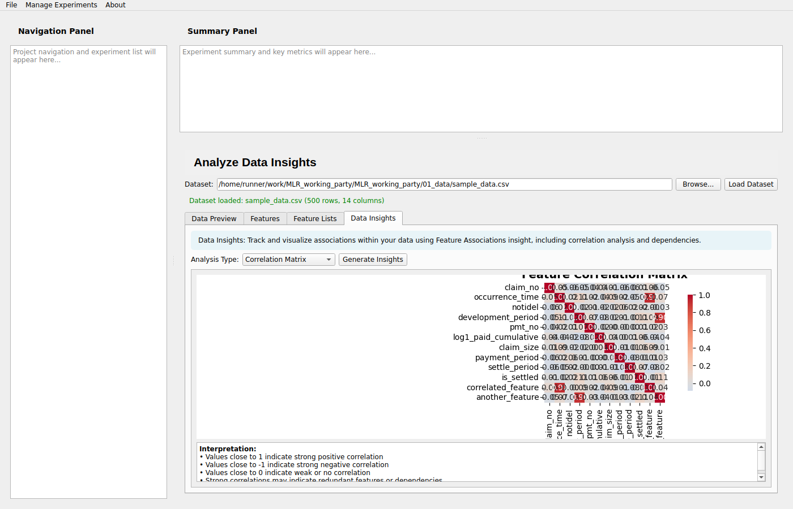
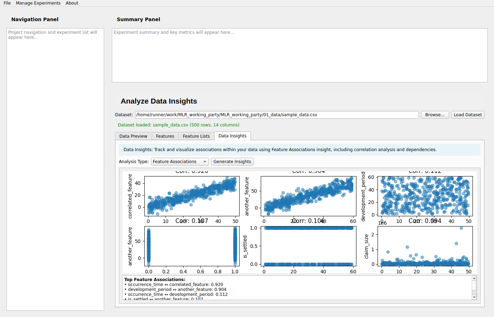
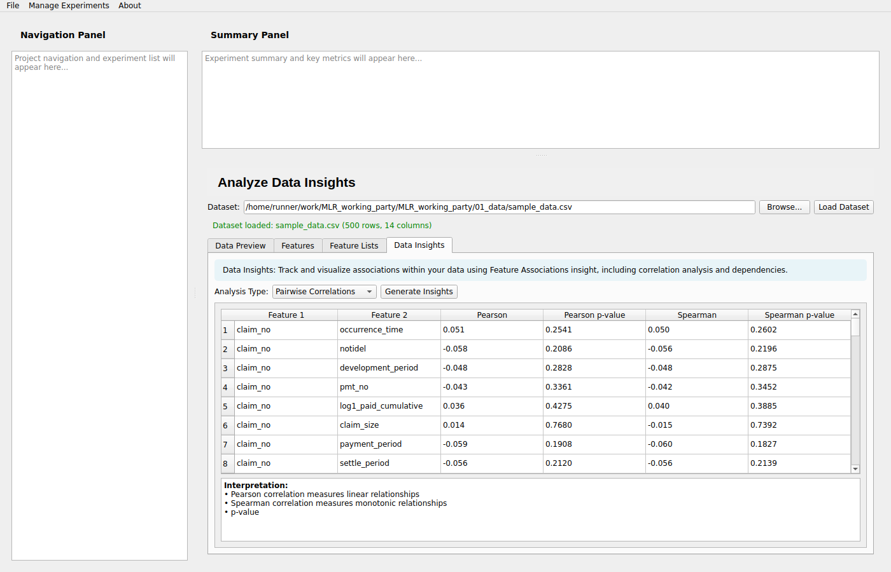
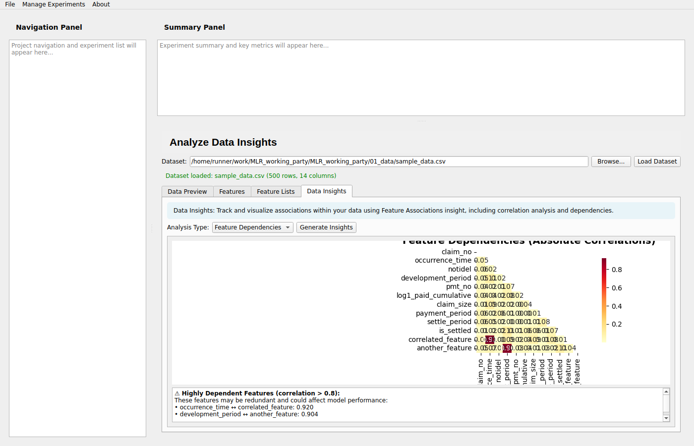

# Visual Guide to the MLR GUI Application

This guide provides a visual walkthrough of the PyQt6 GUI application with all implemented features.

## Quick Visual Reference

### 1. Main Application Window

**Features shown:**
- 3-pane layout (left navigation, top summary, center content)
- Menu bar with File, Manage Experiments, About menus
- Clean, professional interface

---

### 2. Analyze Data Insights - Initial View

**Features shown:**
- Empty state with instructions
- Dataset loading interface
- Browse and Load buttons
- Status indicator

---

### 3. Data Preview Tab (Tile 1)

**Features shown:**
- Visual representation of each feature
- Histograms for numeric features
- Bar charts for categorical features
- Summary statistics
- Scrollable interface for all features

**Key capabilities:**
- Automatic type detection (numeric vs categorical)
- Frequent value analysis
- Adjustable sample size (10-10,000 rows)
- Missing value indicators

---

### 4. Features Tab (Tile 2)

**Features shown:**
- Comprehensive feature table with all metrics
- Selected feature with detailed statistics panel
- Column headers: Feature, Type, Missing %, Unique, Mean, Std, Min, Max
- Interactive row selection

**Key capabilities:**
- Sort by any column
- View detailed statistics for any feature
- Identify missing values at a glance
- Quick feature overview

---

### 5. Feature Lists Tab (Tile 3)

**Features shown:**
- List of existing feature lists
- Multi-select interface for creating new lists
- Name input for custom feature lists
- Delete and retrain controls

**Key capabilities:**
- Create custom feature lists
- Select multiple features at once
- Manage existing lists
- Integration with model retraining

---

### 6. Correlation Matrix (Tile 4 - Analysis Type 1)

**Features shown:**
- Heatmap of feature correlations
- Color-coded values (-1 to +1)
- Annotated correlation coefficients
- Interpretation guide

**Key insights:**
- Identify strongly correlated features
- Detect positive/negative relationships
- Find redundant features
- Guide feature selection

---

### 7. Feature Associations (Tile 4 - Analysis Type 2)

**Features shown:**
- Top 6 correlated feature pairs
- Scatter plots for each pair
- Correlation coefficient display
- Summary information

**Key insights:**
- Visualize relationships between features
- Identify non-linear associations
- Understand data patterns
- Support feature engineering

---

### 8. Pairwise Correlations (Tile 4 - Analysis Type 3)

**Features shown:**
- Detailed correlation table
- Pearson correlation with p-values
- Spearman correlation with p-values
- Statistical significance indicators

**Key insights:**
- Test for linear relationships (Pearson)
- Test for monotonic relationships (Spearman)
- Assess statistical significance
- Compare correlation methods

---

### 9. Feature Dependencies (Tile 4 - Analysis Type 4)

**Features shown:**
- Absolute correlation heatmap
- Highly dependent feature warnings
- Redundancy detection (threshold > 0.8)
- Color-coded dependency strength

**Key insights:**
- Identify redundant features
- Detect multicollinearity
- Guide dimensionality reduction
- Improve model performance

---

## Feature Summary

### Data Preview (Tile 1) ✅
- ✓ Visual representations
- ✓ Automatic type detection
- ✓ Histograms for numeric
- ✓ Bar charts for categorical
- ✓ Summary statistics
- ✓ Adjustable sample size

### Features (Tile 2) ✅
- ✓ Comprehensive table
- ✓ All key metrics
- ✓ Interactive selection
- ✓ Detailed statistics panel
- ✓ Missing value analysis
- ✓ Sortable columns

### Feature Lists (Tile 3) ✅
- ✓ Create custom lists
- ✓ Multi-select interface
- ✓ Manage existing lists
- ✓ Delete functionality
- ✓ Retrain integration
- ✓ Easy feature selection

### Data Insights (Tile 4) ✅
- ✓ 4 analysis types
- ✓ Correlation matrix
- ✓ Feature associations
- ✓ Pairwise correlations
- ✓ Feature dependencies
- ✓ Statistical tests
- ✓ Interpretation guides

## Usage Flow

1. **Launch** → `python3 run_gui.py`
2. **Navigate** → Manage Experiments → Analyze Data Insights
3. **Load Data** → Browse and select CSV file
4. **Explore** → Navigate through the 4 tabs
5. **Analyze** → Use different analysis types in Data Insights tab
6. **Create Lists** → Build custom feature lists
7. **Export** → Use insights for model training

## Technical Details

- **GUI Framework**: PyQt6
- **Visualization**: matplotlib, seaborn
- **Statistics**: scipy (Pearson, Spearman)
- **Data Processing**: pandas, numpy
- **Architecture**: Modular, extensible design

## All Available Screenshots

The `screenshots/` directory contains 18 screenshots:

**Basic sequence (9 files):**
1. `01_main_window.png` - Initial application window
2. `02_insights_empty.png` - Empty data insights view
3. `03_data_path_set.png` - Data path configured
4. `04_data_loaded.png` - Data loaded successfully
5. `05_features_tab.png` - Features table view
6. `06_feature_lists.png` - Feature lists management
7. `07_insights_tab.png` - Data insights tab
8. `08_correlation_matrix.png` - Correlation analysis
9. `09_feature_associations.png` - Association analysis

**Demonstration sequence (9 files):**
1. `demo_01_main_window.png`
2. `demo_02_insights_initial.png`
3. `demo_03_data_preview.png`
4. `demo_04_features_table.png`
5. `demo_05_feature_lists.png`
6. `demo_06_correlation_matrix.png`
7. `demo_07_feature_associations.png`
8. `demo_08_pairwise_correlations.png`
9. `demo_09_feature_dependencies.png`

## Next Steps

- Run the application: `python3 run_gui.py`
- Generate sample data: `python3 02_code/generate_sample_data.py`
- Run demo: `cd 02_code && xvfb-run -a python3 demo_gui.py`
- Read documentation: [README.md](README.md) and [02_code/README_GUI.md](02_code/README_GUI.md)

---

*Created for the MLR Working Party project*
